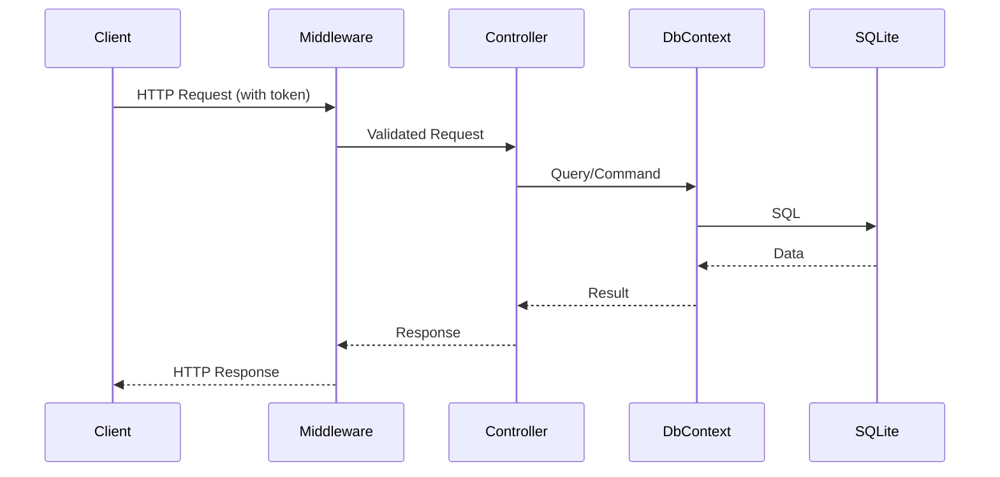

# Building a Simple API with Copilot


A production-ready User Management API for TechHive Solutions, built with .NET, Entity Framework Core, and SQLite. This project demonstrates how GitHub Copilot can accelerate the development of robust, scalable APIs with modern best practices.

## Architecture Sequence Diagram


## Features
- User CRUD operations (Create, Read, Update, Delete)
- Input validation and duplicate checks
- Global exception handling middleware
- Token-based authentication middleware
- Request/response logging middleware
- Pagination and client-side caching
- Bulk user upload automation
- SQLite database integration via EF Core
- Comprehensive documentation and architecture diagram

## Getting Started
1. **Clone the repository**
2. **Build the project:**
   ```
   dotnet build UserManagementAPI/UserManagementAPI.csproj
   ```
3. **Run the API:**
   ```
   dotnet run --project UserManagementAPI/UserManagementAPI.csproj
   ```
4. **Test endpoints:**
   - Use the provided curl commands in [API_Testing_Examples.md](./docs/API_Testing_Examples.md)
   - Explore the API via Swagger UI at `/swagger` (when running in development)

## Documentation
- [System Architecture Diagram](./docs/architecture.md)
- [API Testing Examples](./docs/API_Testing_Examples.md)
- [Middleware Design](./docs/Middleware_Design.md)
- [Development Tools & Best Practices](./docs/Development_Tools.md)
- [Copilot Contributions & Rationale](./Copilot_Contributions.md)

## Bulk Data Migration
Automate user import with the included Python script and sample data. See [Development Tools](./docs/Development_Tools.md) for details.

## Requirements
- .NET 9 SDK
- Python 3 (for bulk upload script)

## License
This project is for demonstration and educational purposes at TechHive Solutions.

---

> Built and documented with the help of GitHub Copilot.
