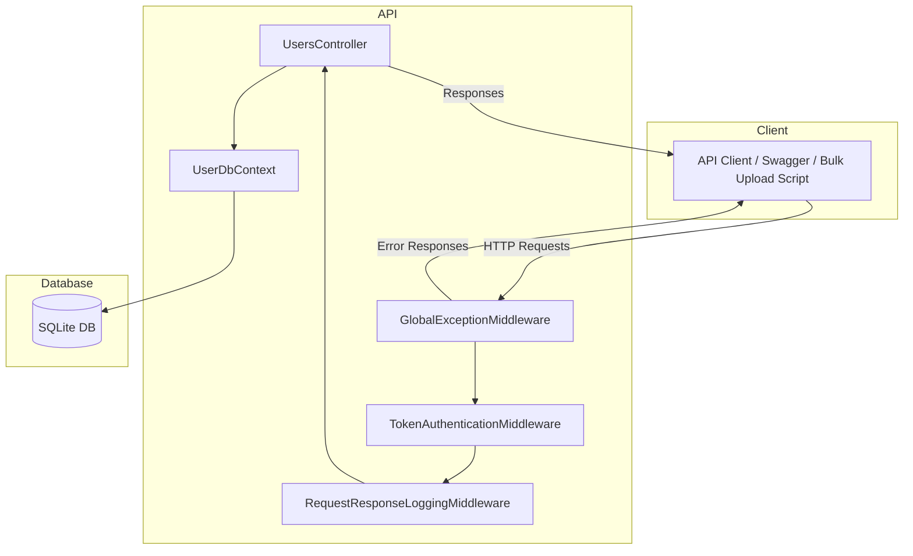

# System Architecture Diagram

**Legend:**
- All requests flow through the middleware pipeline before reaching the controller.
- The controller interacts with the database context, which in turn uses SQLite.
- Clients include Swagger UI, curl, and the bulk upload script.
- Error and authentication handling are centralized in middleware.
